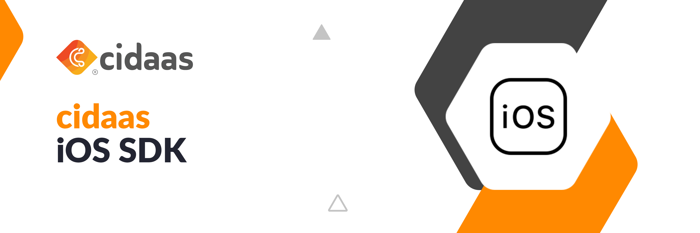

## About cidaas:
[cidaas](https://www.cidaas.com)
 is a fast and secure Cloud Identity & Access Management solution that standardises what’s important and simplifies what’s complex.

## Feature set includes:
* Single Sign On (SSO) based on OAuth 2.0, OpenID Connect, SAML 2.0 
* Multi-Factor-Authentication with more than 14 authentication methods, including TOTP and FIDO2 
* Passwordless Authentication 
* Social Login (e.g. Facebook, Google, LinkedIn and more) as well as Enterprise Identity Provider (e.g. SAML or AD) 
* Security in Machine-to-Machine (M2M) and IoT

# Cidaas SDK for IOS V2
[](https://travis-ci.org/Cidaas/cidaas-sdk-ios-v2) 
[](#installation)

You can find the changelogs [here](/Example/Readme/Changelogs.md)

The steps here will guide you through setting up and managing authentication and authorization in your apps using cidaas SDK.

## Table of Contents

<!--ts-->
* [Requirements](#requirements)
* [Installation](#installation)
* [Getting started](#getting-started)
* [Migrating to Cidaas V3](#migrating-to-cidaas-v3)
* [Getting Client Id and urls](#getting-client-id-and-urls)
* [Initialisation](#initialisation)
* [Usage](#usage)
    <!--ts-->
    * [Native Browser Login](#native-browser-login)
        <!--ts-->
        * [Classic Login](#classic-login)
        * [Social Login](#social-login)
        <!--te-->
    * [Embedded Browser Integration](#wkwebview-integration)
    * [Native UI Integration](/Example/Readme/PureNativeLogin.md)
    * [Verification Integration](/Example/Readme/Passwordless.md)
    * [Consent Management Integration](/Example/Readme/ConsentManagement.md)
    <!--te-->


#### Requirements

Operating System | Xcode | Swift
--- | --- | ---
iOS 11.0 or above | 9.0 or above | 3.3 or above 

#### Installation

Cidaas is available through [CocoaPods](https://cocoapods.org/pods/Cidaas). To install it, simply add the following line to your Podfile:

```
pod 'Cidaas'
```

To use only core functionality and to reduce the size of the dependency

```
pod 'Cidaas/Core'
```

#### Getting started

The following steps are to be followed to use this cidaas SDK.

Create a plist file named <b>Cidaas.plist</b> and fill all the inputs in key value pair. The inputs are mentioned below.

A sample plist file would look like this :

```xml
<?xml version="1.0" encoding="UTF-8"?>
<!DOCTYPE plist PUBLIC "-//Apple//DTD PLIST 1.0//EN" "http://www.apple.com/DTDs/PropertyList-1.0.dtd">
<plist version="1.0">
    <dict>
        <key>DomainURL</key>
        <string>Your Domain URL</string>
        <key>RedirectURL</key>
        <string>Your redirect url</string>
        <key>ClientId</key>
        <string>Your client id</string>
        <key>CidaasVersion</key>
        <string>Your instances major Cidaas Version</string>
    </dict>
</plist>
```

## Migrating to Cidaas V3

Cidaas V3 has response handling adjustment on some of the cidaas service calls. To migrate to cidaas V3, you need to do the following:

* Ensure that you use at least cidaas version: 3.97.0. You can find the cidaas version from cidaas service portal, and ask our customer service if it needs to be updated.
* Ensure that you use at least cidaas-ios-sdk version: 1.3.2
* add CidaasVersion  to <b>Cidaas.plist</b>

For Example:

```xml
<?xml version="1.0" encoding="UTF-8"?>
<!DOCTYPE plist PUBLIC "-//Apple//DTD PLIST 1.0//EN" "http://www.apple.com/DTDs/PropertyList-1.0.dtd">
<plist version="1.0">
    <dict>
        <key>DomainURL</key>
        <string>Your Domain URL</string>
        <key>RedirectURL</key>
        <string>Your redirect url</string>
        <key>ClientId</key>
        <string>Your client id</string>
        <key>CidaasVersion</key>
        <string>3</string>
    </dict>
</plist>
```

The following sections will help you to generate some of the information that is needed for plist.

#### Getting Client Id and urls
When you are integrating your own Business App with, you may want to modularize the interactions and attributes. There are  like Scope, Roles, Grant-Types, re-direct URLs etc., that you may want to group into one configuration/settings. This can be done by creating  App or Client.


#### Initialization

The first step to integrate cidaas sdk is the initialization process.

```swift
var cidaas = Cidaas();
```
or use the shared instance

```swift
var cidaas = Cidaas.shared
```

#### Usage

#### Native Browser Login 
#### Classic Login
You can login using your native browser and you will be redirected to the App after successful login. To login with your native browser call ****loginWithBrowser()****.

```swift
var extraParams = Dictionary<String, String>()
extraParams[scopes]="offline_access phone"
cidaas.loginWithBrowser(delegate: self, extraParams: extraParams) {
    switch $0 {
        case .success(let successResponse):
            // your success code here
            break
        case .failure(let error):
            // your failure code here
            break
    }
}
```

#### Social Login
You can also perform social login using your native browser and you will be redirected to the App after successful login. To perform social login call ****loginWithSocial()****.

```swift
cidaas.loginWithSocial(provider: "your_social_provider", delegate: self) { 
    switch $0 {
        case .success(let successResponse):
            // your success code here
            break
        case .failure(let error):
            // your failure code here
            break
    }
}
```
where social provider may be either facebook, google, linkedin or any other providers

Use [customScheme](https://developer.apple.com/documentation/uikit/core_app/communicating_with_other_apps_using_custom_urls#2928963) or [universalLinks](https://developer.apple.com/library/content/documentation/General/Conceptual/AppSearch/UniversalLinks.html) to return back the control from browser to App.

    Note : Don't forget to add the custom scheme url in your App's redirect url section

## WKWebview integration

Drag and drop an empty view in the storyboard

Change the name of the class in the properties window as **CidaasView**

Create an IBOutlet for the class and consider this as an object

```swift
@IBOutlet var cidaasView: CidaasView! 
```

Inherit the WKNavigationDelegate and call the methods

```swift
func webView(_ webView: WKWebView, didStartProvisionalNavigation navigation: WKNavigation!) {
    cidaasView.webView(webView, didStartProvisionalNavigation: navigation)
}

func webView(_ webView: WKWebView, didFail navigation: WKNavigation!, withError error: Error) {
    cidaasView.webView(webView, didFail: navigation, withError: error)
}

func webView(_ webView: WKWebView, decidePolicyFor navigationAction: WKNavigationAction, decisionHandler: @escaping (WKNavigationActionPolicy) -> Void) {
    cidaasView.webView(webView, decidePolicyFor: navigationAction, decisionHandler: decisionHandler)
}

func webView(_ webView: WKWebView, didFinish navigation: WKNavigation!) {
    cidaasView.webView(webView, didFinish: navigation)
}
```
   
Call the **loginWithEmbeddedBrowser()** function and get the access token as callback
   
```swift
cidaasView.loginWithEmbeddedBrowser(delegate: self) {
    switch $0 {
        case .success(let successResponse):
            // your success code here
            break
        case .failure(let error):
            // your failure code here
        break
    }
}  
```

## Screenshots
<p align="center">


</p>
